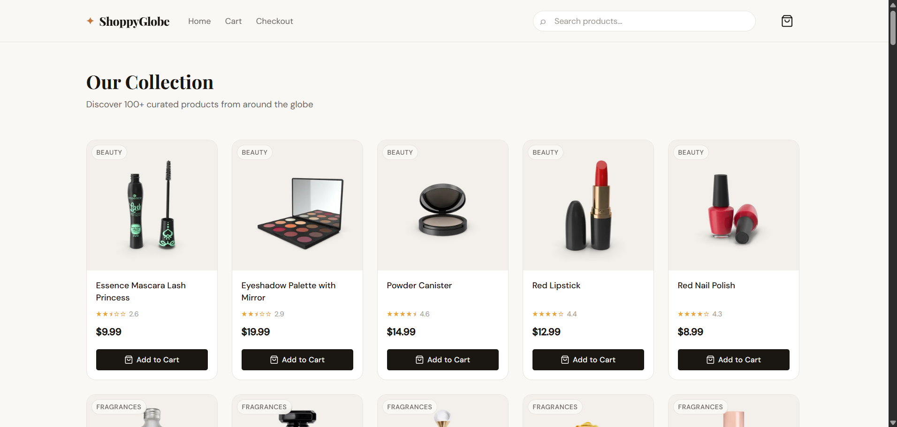

# ✦ ShoppyGlobe

A modern, responsive e-commerce application built with **React + Vite**, featuring Redux state management, dynamic routing, lazy loading, and a complete checkout flow.

> **Repository:** https://github.com/JAI1209/ShoppyGlobe

---

## 🚀 Features

- **Product Catalog** — Fetches 100+ products from [DummyJSON](https://dummyjson.com/products) with search filtering
- **Product Detail** — Full product pages with image galleries, ratings, and specs
- **Shopping Cart** — Add, remove, increase/decrease quantity with live totals
- **Checkout** — Validated form with order summary, free-shipping threshold, and post-order redirect
- **Redux State** — Cart and search state managed with Redux Toolkit
- **Code Splitting** — All pages lazy-loaded with React.lazy + Suspense
- **Responsive UI** — Mobile-first design that works on all screen sizes
- **Error Handling** — Graceful loading/error states throughout

---

## 🗂️ Folder Structure

```
shoppyglobe/
├── public/
│   └── favicon.svg
├── src/
│   ├── assets/          # Static assets (images, icons)
│   ├── components/      # Reusable UI components
│   │   ├── Header.jsx / Header.css
│   │   ├── ProductItem.jsx / ProductItem.css
│   │   └── CartItem.jsx / CartItem.css
│   ├── hooks/           # Custom React hooks
│   │   └── useProducts.js
│   ├── pages/           # Page-level components
│   │   ├── ProductList.jsx / ProductList.css
│   │   ├── ProductDetail.jsx / ProductDetail.css
│   │   ├── Cart.jsx / Cart.css
│   │   ├── Checkout.jsx / Checkout.css
│   │   └── NotFound.jsx / NotFound.css
│   ├── redux/           # Redux Toolkit store & slices
│   │   ├── store.js
│   │   ├── cartSlice.js
│   │   └── searchSlice.js
│   ├── routes/          # React Router configuration
│   │   └── AppRouter.jsx
│   ├── styles/          # Global CSS variables & resets
│   │   └── global.css
│   ├── App.jsx          # Root component with Redux Provider
│   └── main.jsx         # Entry point
├── index.html
├── vite.config.js
└── package.json
```

---

## 🛠️ Tech Stack

| Technology | Purpose |
|------------|---------|
| React 18 | UI library |
| Vite 5 | Build tool & dev server |
| Redux Toolkit | Global state management |
| React Router v6 | Client-side routing |
| DummyJSON API | Product data source |

---

## ⚡ Getting Started

### Prerequisites
- Node.js 18+ and npm

### Installation

```bash
# Clone the repository
git clone https://github.com/JAI1209/ShoppyGlobe.git
cd shoppyglobe

# Install dependencies
npm install

# Start development server
npm run dev
```

Open [http://localhost:5173](http://localhost:5173) in your browser.

### Build for Production

```bash
npm run build
npm run preview
```

---

## 📦 Redux State Shape

```js
{
  cart: {
    items: [
      { id, title, price, thumbnail, category, quantity }
    ]
  },
  search: {
    query: ""
  }
}
```

### Cart Actions
| Action | Description |
|--------|-------------|
| `addToCart(product)` | Add product or increment quantity |
| `removeFromCart(id)` | Remove product entirely |
| `incrementQuantity(id)` | +1 quantity |
| `decrementQuantity(id)` | -1 quantity (min: 1) |
| `clearCart()` | Empty the cart |

### Search Actions
| Action | Description |
|--------|-------------|
| `setSearchQuery(query)` | Set search filter |
| `clearSearch()` | Reset search |

---

## 🗺️ Routes

| Path | Component | Description |
|------|-----------|-------------|
| `/` | ProductList | Home — product grid with search |
| `/product/:id` | ProductDetail | Individual product detail page |
| `/cart` | Cart | Cart management |
| `/checkout` | Checkout | Checkout form & order placement |
| `*` | NotFound | 404 catch-all |

---

## 🎨 Design System

The UI uses CSS custom properties for a consistent design language:

- **Fonts:** Playfair Display (display) + DM Sans (body)
- **Primary accent:** `#c4783c` (warm amber/terracotta)
- **Background:** `#faf8f5` (warm off-white)
- **Responsive breakpoints:** 480px, 640px, 768px, 900px

---

## 🧩 Performance Optimizations

- **Code splitting** — Each page is a separate JS chunk via `React.lazy()`
- **Suspense boundaries** — Pages show a spinner while their chunk loads
- **Lazy image loading** — All `` tags use `loading="lazy"`
- **AbortController** — Fetch requests are cancelled on component unmount
- **useMemo** — Search filtering is memoized to avoid re-computation

---

## 📝 Git Commit History

This project maintains 25+ meaningful commits covering:

1. `init: scaffold Vite + React project`
2. `feat: add global CSS design system and variables`
3. `feat: create Redux store with toolkit`
4. `feat: implement cartSlice with add/remove/quantity actions`
5. `feat: implement searchSlice for global search state`
6. `feat: create useProducts custom hook with AbortController`
7. `feat: build Header component with logo, nav, and search`
8. `style: add Header responsive CSS with mobile menu`
9. `feat: create ProductItem card component`
10. `style: add ProductItem CSS with hover animations`
11. `feat: build ProductList page with grid layout`
12. `feat: connect ProductList search to Redux state`
13. `feat: create ProductDetail page with dynamic routing`
14. `feat: add image gallery with thumbnail strip to ProductDetail`
15. `feat: implement CartItem component with quantity controls`
16. `style: add CartItem responsive CSS`
17. `feat: build Cart page with order summary sidebar`
18. `feat: add free shipping threshold progress to Cart`
19. `feat: create Checkout page with form validation`
20. `feat: add payment field auto-formatting to Checkout`
21. `feat: implement order placement flow with cart clear + redirect`
22. `feat: add order success screen to Checkout`
23. `feat: create NotFound 404 page`
24. `feat: configure AppRouter with createBrowserRouter`
25. `perf: add React.lazy + Suspense code splitting to all routes`
26. `docs: add comprehensive README`
27. `fix: handle image load errors with fallback placeholders`
28. `style: polish mobile responsiveness across all pages`

---

## 📄 License

MIT — feel free to use this project for learning and portfolio purposes.


#screenshots 

